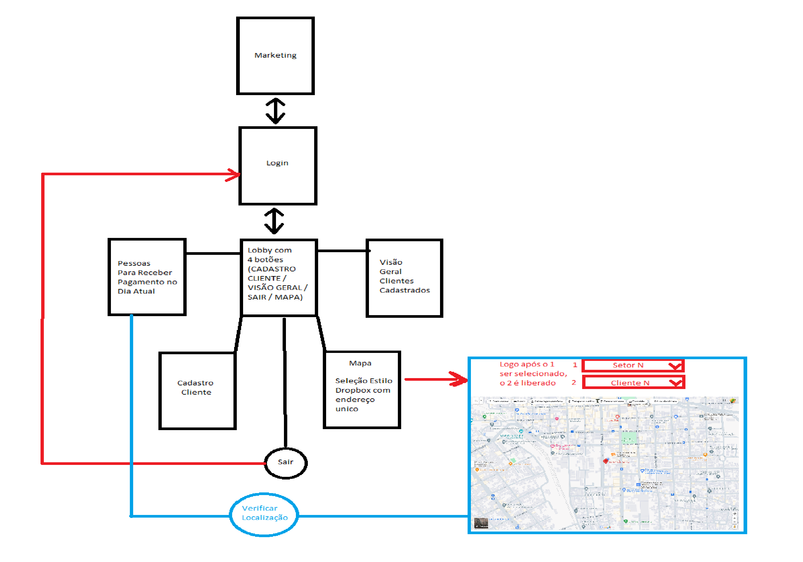

# Projeto integrador

Projeto integrador web, UC 15.

## Como clonar o projeto
1. Abrir a pasta onde deseja que o projeto fique
2. Abrir o CMD ou Code Bash Here
3. Digitar: `git clone https://github.com/pajegues/projeto_integrador_react`
4. Entrar na pasta do projeto: `cd projeto_integrador_react`
5. Instalar os pacotes do Node: `npm install`
6. Pronto :)

## Divisão de tarefas

- _José_:  Visão Geral + Botão Sair + Lobby
- _Alef_: Mapa
- _Ailson_: Pessoas devendo pagamento + 
- _Vinicius_: Marketing
- _Rogério_: Login

